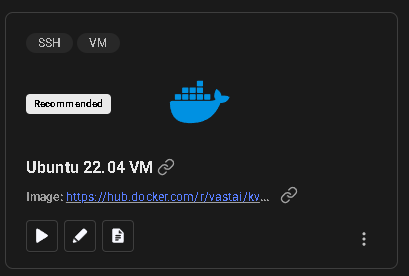

# Vast ai guide

Here I will explain shortly what you need to do for vast.ai setup.

Go to the website [vast.ai](https://cloud.vast.ai/) and login with your account.
Next, make a private template based on some Ubuntu image that vast.ai already provides.

In our case we will make use of the Ubuntu 22.04 version:

Then click on the pencil symbol to edit the template. In our case we chose the Ubuntu 24.04 version as the vm-version provided by Vast.ai. You can find this by clicking on the "VM-Version" and search for your specific image you want to use.

Copy paste the [on-start](on_startup.sh) script, in the section called "On-start Script".

After doing this and you setup your account properly by adding a ssh key (not going to explain this), go to search and select your template you created.

Choose the GPU you want, wait till the creation is done and ssh connect and you are set to go.
